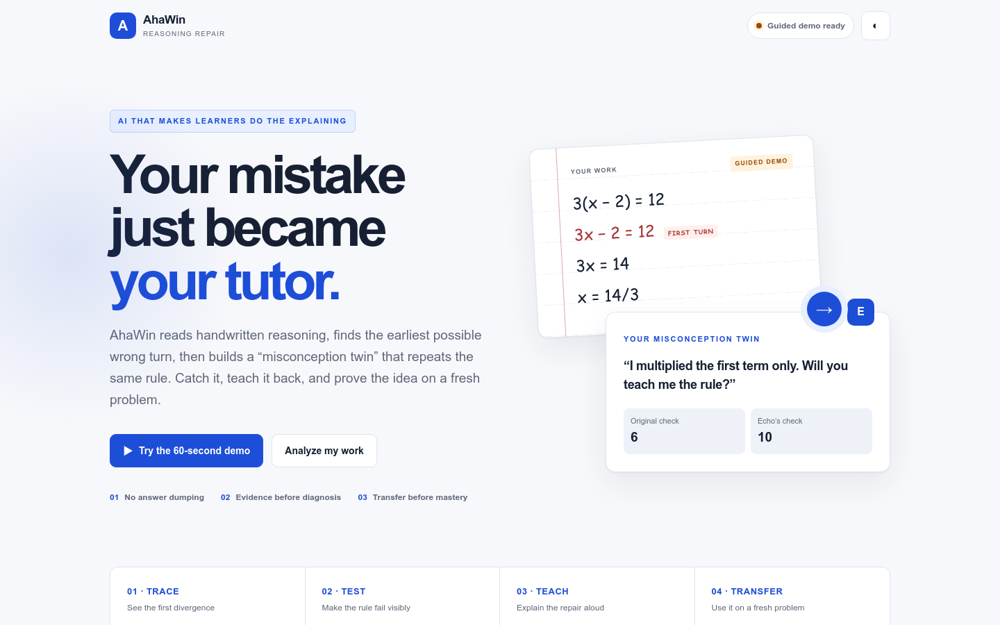
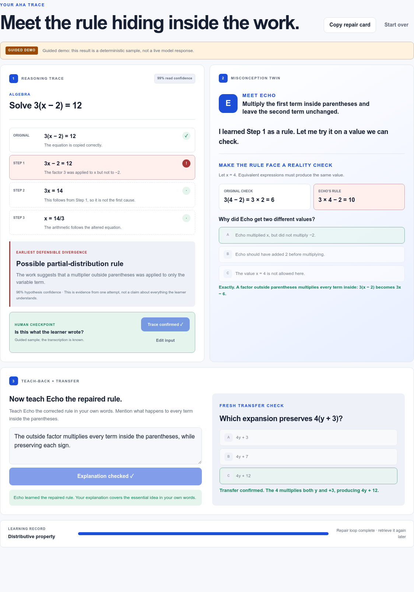
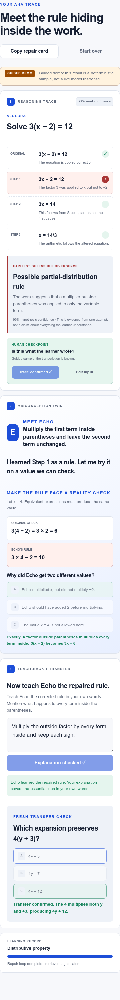

# AhaWin

> **Teach your mistake until it disappears.**

AhaWin turns one handwritten STEM wrong turn into a **misconception twin** the learner must catch, teach, and defeat on a fresh problem.



## Problem

A learner can make one conceptual error, then continue through several internally consistent steps. Camera solvers usually optimize for reaching the answer. A red mark says *what* is wrong; a solved example can remove the effort needed to understand *why*.

## Solution

AhaWin reverses the roles:

1. Read typed or handwritten reasoning.
2. Mark the earliest **defensible** divergence.
3. Ask the learner to confirm the transcription.
4. Create Echo, a novice that repeats the apparent rule.
5. Make that rule fail on a small, checkable counterexample.
6. Require a teach-back in the learner's own words.
7. Verify transfer on a fresh problem.

The system presents a **possible** misconception, keeps evidence and uncertainty visible, and never claims to read a learner's mind.

## Demo

- **Deployed app:** add the verified Vercel production URL after deployment
- **Two-minute video:** add the final public video URL before submission
- **Guided local path:** `http://127.0.0.1:4173/?demo=1`
- **Video script:** [`docs/demo-script.md`](docs/demo-script.md)

### Completed learning loop



### Mobile flow



## The 60-second magic moment

For `3(x − 2)`, the learner's apparent partial-distribution rule produces `3x − 2`. With `x = 4`, the original expression gives **6** while Echo's rule gives **10**. The learner must explain the mismatch before teach-back and transfer unlock.

## Key features

- Image or typed STEM evidence
- Local image resizing and bounded server input
- Three honest states: possible misconception, no divergence, or more evidence needed
- Evidence-linked earliest-divergence trace
- Read confidence and mandatory human confirmation
- Personalized misconception twin
- Side-by-side falsifying check
- Rubric-aware teach-back with a local resilience path
- Fresh transfer item and copyable repair card
- Explicit guided demo that never pretends to be live
- Best-effort rate limiting, timeouts, security headers, and secret scan
- Responsive light/dark interface with reduced-motion support

## Why AI is essential

A fixed template can replay the guided algebra sample. It cannot generalize across varied handwriting and subjects, infer a bounded rule hypothesis from the learner's actual path, generate an appropriate falsifying example, or evaluate a domain-specific explanation. Removing Gemini collapses the live value proposition.

## Learning-science mechanism

| Mechanism | Product behavior |
|---|---|
| Formative feedback | Feedback points to the earliest evidence-bearing step |
| Cognitive conflict | The inferred rule produces a visible contradiction |
| Metacognition | The learner confirms and inspects the reasoning trace |
| Teach-back | The learner reconstructs the corrected principle |
| Retrieval and transfer | A fresh item is required before completion |
| Scaffolding | Test → explain → transfer unlocks progressively |

See [`docs/research-ledger.md`](docs/research-ledger.md) for the evidence and limitations behind these choices.

## Architecture

```text
handwritten image / typed steps
              │
              ▼
bounded server endpoint ──► Gemini multimodal structured output
              │                         │
              └──────── semantic validation
                                        │
                                        ▼
confirmed trace → Echo check → teach-back → transfer
```

- `public/index.html`, `public/styles.css`, `public/ui.js` — static browser experience isolated from the server runtime
- `lib/core.js` — prompts, schemas, normalization, Gemini adapter, fixture, rubric checks
- `lib/rate-limit.js` — ephemeral hashed client limit
- `api/` — the only Vercel serverless endpoints
- `scripts/local-server.mjs` — local parity server
- `scripts/verify-deployment-layout.mjs` — prevents browser files from becoming Vercel functions
- `tests/` and `scripts/` — automated checks and safety evaluation

Full detail: [`docs/architecture.md`](docs/architecture.md).

## Model strategy

- Default model: `gemini-3.8-flash`, configurable in one server-side variable
- Image and text are analyzed together
- JSON schema constrains the output
- Semantic invariants reject contradictory or incomplete results
- Analysis timeout: 24 seconds, leaving headroom inside Vercel's 30-second function limit
- Provider failures are classified and logged with redacted diagnostics, a safe error code, and a random reference
- Custom analysis fails honestly by default; it does not silently become the sample
- The Gemini key is server-only and must never use a browser-visible prefix

Live model quality remains unevaluated in this repository until a key is configured and the credentialed cases in [`docs/ai-evaluation.md`](docs/ai-evaluation.md) run.

## Local setup

Requirements: Node.js 20 or newer. There are no runtime package dependencies.

```bash
cp .env.example .env
# Add GEMINI_API_KEY to .env only if live analysis is needed.
npm run local
```

Open `http://127.0.0.1:4173`. The guided sample works without credentials.

Never commit `.env`, paste a key into a command, or expose the key through browser code.

## Environment variables

| Variable | Required | Default | Purpose |
|---|---:|---|---|
| `GEMINI_API_KEY` | Live analysis only | unset | Server-side Gemini credential |
| `GEMINI_MODEL` | No | `gemini-3.8-flash` | Central model selection |
| `ALLOW_DEMO_FALLBACK` | No | `false` | Allows a clearly labeled sample only after live failure; leave false for honest fail-closed behavior |
| `PORT` | No | `4173` | Local server port |

## Validation

```bash
npm run verify
```

Current measured local result:

- syntax checks: pass,
- unit tests: **22/22 pass**,
- deterministic evaluation: **17/17 pass**,
- deployment-layout regression: **pass** (`framework: null`, no production `start` script, `public/` output, and Node-safe browser import),
- secret-pattern scan: pass,
- desktop critical flow: pass,
- mobile critical flow: pass,
- no-key failure path: pass,
- horizontal overflow in tested viewports: none,
- live Gemini cases: **not run** because the key was unavailable.

## Privacy and safety

- No account, name, age, or learner identity is requested.
- Images are processed in memory and are not intentionally persisted.
- Uploaded instructions are treated as untrusted evidence.
- Model text is inserted with `textContent`, never executable HTML.
- A human confirmation checkpoint precedes the intervention.
- The tool does not issue a grade or disability diagnosis.
- The guided route is visibly labeled.

See [`SECURITY.md`](SECURITY.md).

## Known limitations

- Handwriting interpretation and generated counterexamples still need credentialed, expert-reviewed evaluation.
- The current build does not symbolically verify arbitrary algebra.
- The in-memory limiter is per warm server instance, not distributed.
- The browser can confirm or reject the whole trace, but cannot edit individual transcribed steps yet.
- There is no real-user evidence of improved retention or achievement.
- Broader subject support should remain behind educator review.

## Judging-criteria map

| Criterion | Evidence in the build |
|---|---|
| Educational impact | Diagnosis, cognitive conflict, teach-back, and transfer replace answer delivery |
| Creative AI/ML | Multimodal evidence becomes a personalized, testable model of the possible wrong rule |
| Technical execution | Strict output invariants, fail-closed errors, tests, responsive UI, accessibility, privacy, and Vercel-ready endpoints |
| Pitch and demo | Photo → first turn → 6-versus-10 contradiction → teach-back → fresh transfer in one coherent story |

## Research and decision artifacts

- [`docs/assumptions.md`](docs/assumptions.md)
- [`docs/problem-map.md`](docs/problem-map.md)
- [`docs/research-ledger.md`](docs/research-ledger.md)
- [`docs/idea-longlist.md`](docs/idea-longlist.md)
- [`docs/scorecard.md`](docs/scorecard.md)
- [`docs/decision-memo.md`](docs/decision-memo.md)
- [`docs/product-spec.md`](docs/product-spec.md)
- [`docs/architecture.md`](docs/architecture.md)
- [`docs/ai-evaluation.md`](docs/ai-evaluation.md)
- [`docs/qa-report.md`](docs/qa-report.md)
- [`docs/demo-script.md`](docs/demo-script.md)
- [`docs/submission-checklist.md`](docs/submission-checklist.md)
- [`docs/release-guide.md`](docs/release-guide.md)
- [`docs/live-analysis-runbook.md`](docs/live-analysis-runbook.md)

## Credits

Built for the AI education hackathon. Add final team member names and roles before submission.

## License

MIT — see [`LICENSE`](LICENSE).
